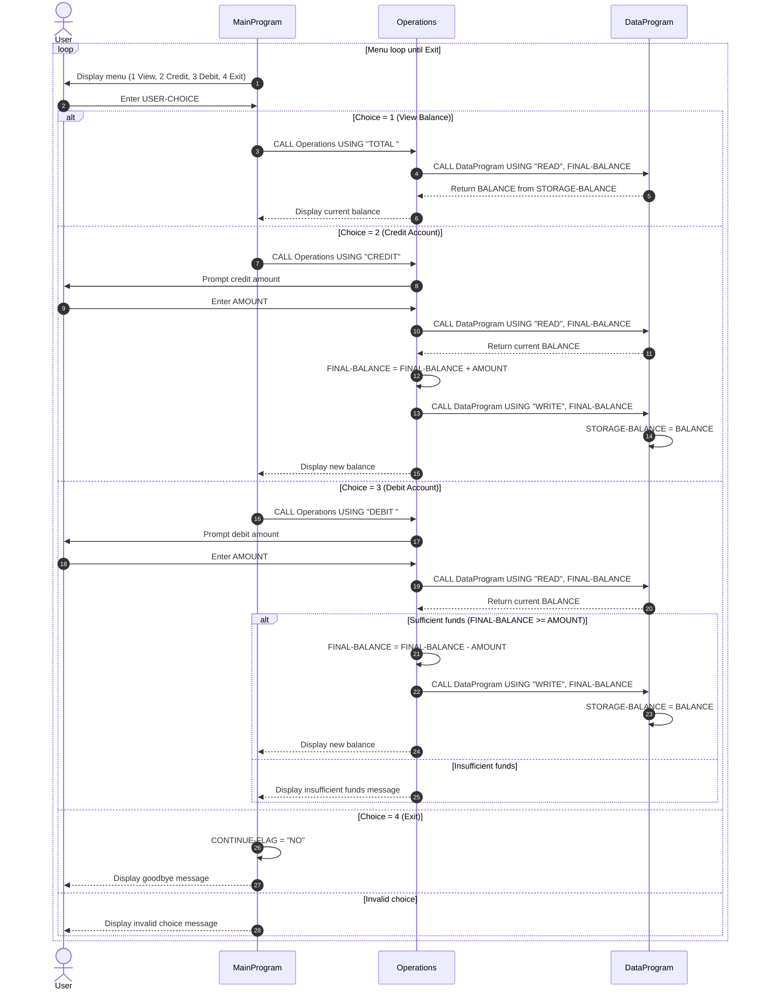

# Student Account COBOL Documentation

## Overview

This project is a simple student account management system implemented in COBOL.
It is split into three programs:

- `MainProgram` handles user interaction and menu navigation.
- `Operations` applies account operations (view, credit, debit).
- `DataProgram` stores and returns the current balance in memory.

Together, they model a basic account lifecycle where a user can view the current balance, add funds, and remove funds with validation.

## COBOL File Purposes

### src/cobol/main.cob

**Program ID:** `MainProgram`

**Purpose:**
- Serves as the entry point for the application.
- Displays the account menu in a loop until the user chooses to exit.
- Routes the selected action to the `Operations` program.

**Key Logic:**
- `MAIN-LOGIC` paragraph:
  - Shows menu options:
    - 1: View Balance
    - 2: Credit Account
    - 3: Debit Account
    - 4: Exit
  - Uses `EVALUATE USER-CHOICE` to dispatch operations.
  - Calls `Operations` with one of these operation codes:
    - `TOTAL `
    - `CREDIT`
    - `DEBIT `
  - Ends loop when option 4 sets `CONTINUE-FLAG` to `NO`.

### src/cobol/operations.cob

**Program ID:** `Operations`

**Purpose:**
- Implements account transaction behavior.
- Collects transaction amounts from the user for credit/debit actions.
- Reads and writes account balance through `DataProgram`.

**Key Logic:**
- Receives `PASSED-OPERATION` through linkage.
- `TOTAL ` operation:
  - Calls `DataProgram` with `READ`.
  - Displays current balance.
- `CREDIT` operation:
  - Accepts an amount.
  - Reads current balance.
  - Adds amount to balance.
  - Writes updated balance.
  - Displays new balance.
- `DEBIT ` operation:
  - Accepts an amount.
  - Reads current balance.
  - Debits only when funds are sufficient.
  - Writes updated balance if successful.
  - Displays insufficient funds message otherwise.

### src/cobol/data.cob

**Program ID:** `DataProgram`

**Purpose:**
- Provides a simple data access layer for account balance.
- Centralizes balance reads and writes.

**Key Logic:**
- Maintains `STORAGE-BALANCE` in working storage.
- Receives operation and balance through linkage.
- `READ` operation:
  - Moves `STORAGE-BALANCE` into passed `BALANCE`.
- `WRITE` operation:
  - Moves passed `BALANCE` into `STORAGE-BALANCE`.

## Key Functions and Program Interfaces

Since this is procedural COBOL, behavior is organized around paragraphs and program calls rather than class methods.

- Entry loop: `MAIN-LOGIC` in `MainProgram`.
- Operation dispatcher: conditional logic in `Operations` based on `PASSED-OPERATION`.
- Data access interface: `DataProgram` using operation codes `READ` and `WRITE`.

### Cross-program call contracts

- `MainProgram` -> `Operations`:
  - `CALL 'Operations' USING <operation-code>` where code is 6 characters.
- `Operations` -> `DataProgram`:
  - `CALL 'DataProgram' USING 'READ', FINAL-BALANCE`
  - `CALL 'DataProgram' USING 'WRITE', FINAL-BALANCE`

Operation code values are fixed-width and include trailing spaces where needed (`TOTAL ` and `DEBIT `).

## Student Account Business Rules

The following business rules are enforced by the current implementation:

1. Initial balance default:
   - Account balance starts at `1000.00` in `DataProgram` storage.

2. View balance:
   - Selecting menu option 1 retrieves and displays the current stored balance.

3. Credit operation:
   - Any entered credit amount is added to the current balance.
   - The resulting balance is persisted by calling `WRITE`.

4. Debit operation with funds check:
   - Debit is allowed only when `current balance >= debit amount`.
   - If funds are insufficient, balance is unchanged and an error message is shown.

5. In-memory persistence scope:
   - Balance is persisted in working storage while the program is running.
   - No file or database persistence exists in the current design.

6. Input routing and validation:
   - Only menu choices 1-4 are accepted as valid actions.
   - Invalid choices are rejected with a message and the menu is shown again.

## Notes and Limitations

- Numeric amount validation (e.g., non-numeric input, negative values) is not explicitly handled.
- There is no transaction history or audit trail for student account activity.
- Data is not retained after program termination.

## Sequence Diagram (Data Flow)

